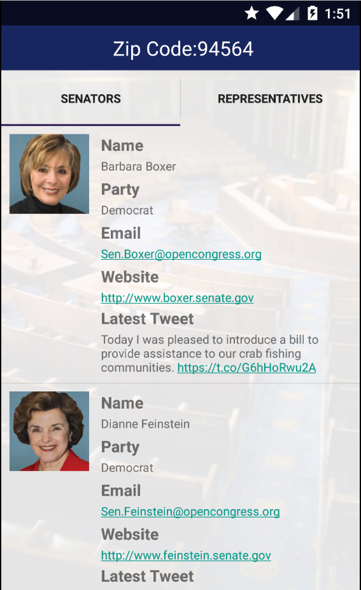

# PROG 02: Represent!

Known Issues:

Emulator support is shaky.
Did not implement shake to random location.

Description:

An app for the mobile and wear that allows you to access details about your local legislators. Supports wear for Moto 360 and various forms of the mobile side. Thank you and I hope you enjoy!

## Authors

Marc Phillip A. Mart ([m.mart@berkeley.edu](mailto:m.mart@berkeley.edu))

## Demo Video

See [Prog 2C: Represent!] (https://youtu.be/pgwBHl8gwYQ)

## Screenshots

                           

                           

                           

                           

                           

                           

                           

                           

                           
                           

## Acknowledgments

* Hat tip to anyone who's code was used
* Any other support
                           
THANK YOU TO ALL THE OTHER CS160 STUDENTS WHO TRIED HELPING ME DEBUG. YOU GUYS ARE THE REAL MVPS ALONG WITH:

Stack Overflow and Developers.Android
http://stackoverflow.com/questions/13095494/how-to-detect-swipe-direction-between-left-right-and-up-down
